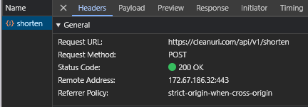
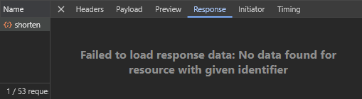
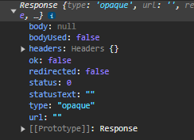

# Frontend Mentor - Shortly URL shortening API Challenge solution

This is a solution to the [Shortly URL shortening API Challenge challenge on Frontend Mentor](https://www.frontendmentor.io/challenges/url-shortening-api-landing-page-2ce3ob-G). Frontend Mentor challenges help you improve your coding skills by building realistic projects.

## Table of contents

- [Overview](#overview)
  - [The challenge](#the-challenge)
  - [Screenshot](#screenshot)
  - [Links](#links)
- [My process](#my-process)
  - [Built with](#built-with)
  - [What I learned](#what-i-learned)
  - [Continued development](#continued-development)
  - [Useful resources](#useful-resources)
- [Author](#author)

## Overview

### The challenge

Users should be able to:

- View the optimal layout for the site depending on their device's screen size ✅
- Shorten any valid URL ✅
- See a list of their shortened links, even after refreshing the browser ✅
- Copy the shortened link to their clipboard in a single click ✅
- Receive an error message when the `form` is submitted if:
  - The `input` field is empty ✅

### Screenshots

| Desktop                                         |                     Mobile                     |
| ----------------------------------------------- | :--------------------------------------------: |
|  |  |
|                                                 |                                                |

_\* These are going to take a while to load, might as well just visit the live site below_

### Links

- Solution URL: [on Frontend Mentor](https://www.frontendmentor.io/solutions/url-shortening-api-landing-page-BSt5i3Bc7M)
- Live Site URL: [on Vercel](https://url-shortening-iota-eight.vercel.app/)

## My process

### Built with

- Mobile-first workflow
- [Tailwind](https://tailwindcss.com/) - CSS Framework
- [React](https://reactjs.org/) - JS library
- [SWR](https://swr.vercel.app/) - React Hooks for Data Fetching
- [Typescript](https://www.typescriptlang.org/) - Strongly typed programming language built on JS

### What I learned

I tried SWR for fetching for the first time. I must say, pretty neat!

### Continued development

I had a really terrible experience with [cleanuri](https://cleanuri.com/docs). I spent so much time trying to make it work.

I was getting a successful `200` status code in the browser `Networks` tab (shown below);

The "Response" tab showed this;

and when I log the response to the console, I get this;

I tried using `fetch` with `useEffect` (no SWR) - no luck, I tried `axios` - nothing!

I didn't want to give up so easily.

This wasted a lot of my time - almost a whole day, simply because I didn't want to admit defeat and just use another API. In the end, that's exactly what I did. I used [Shrtlnk API](https://shrtlnk.dev/developer) instead, and with [SWR](https://swr.vercel.app/), I accomplished it in about five minutes.

Going forward, I think I should know when to stop and look for alternatives when something just doesn't work.

Oh, and I think I should start writing tests for my projects too.

## Author

- Website - _In progress_
<!-- [Brown Memoye](#) Website in progress -->
- Frontend Mentor - [@memoye](https://www.frontendmentor.io/profile/memoye)
- 𝕏 - [@memoye_io](https://www.x.com/memoye_io)
- LinkedIn - [Brown Memoye](https://www.linkedin.com/in/b-me)
